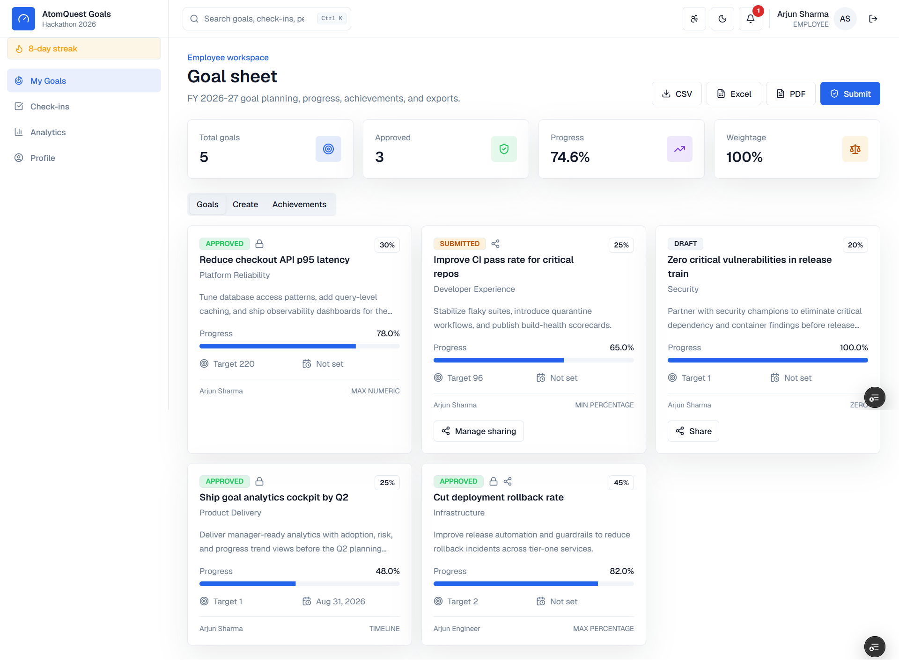
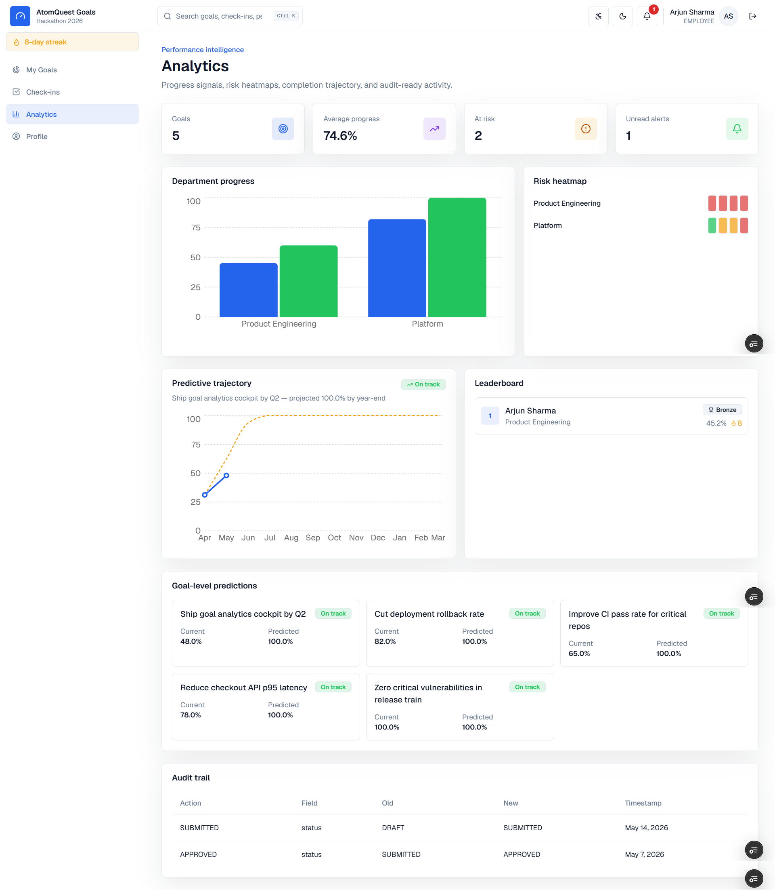
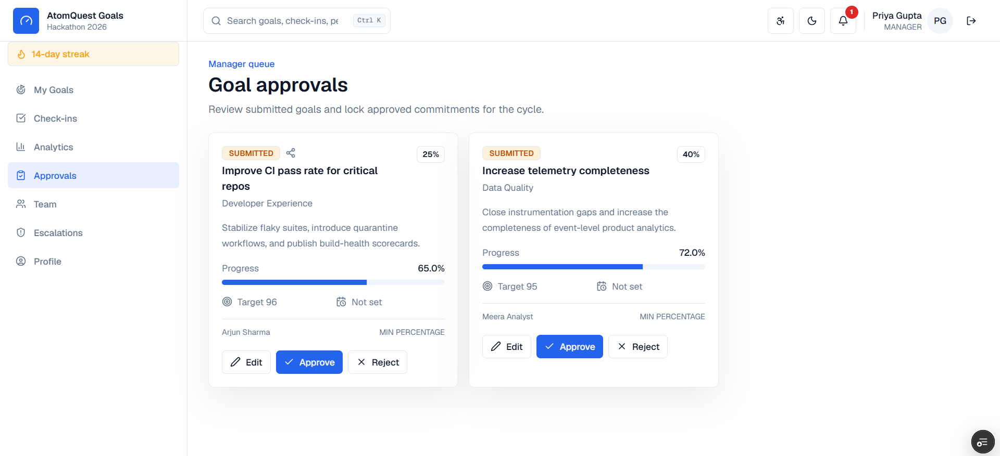
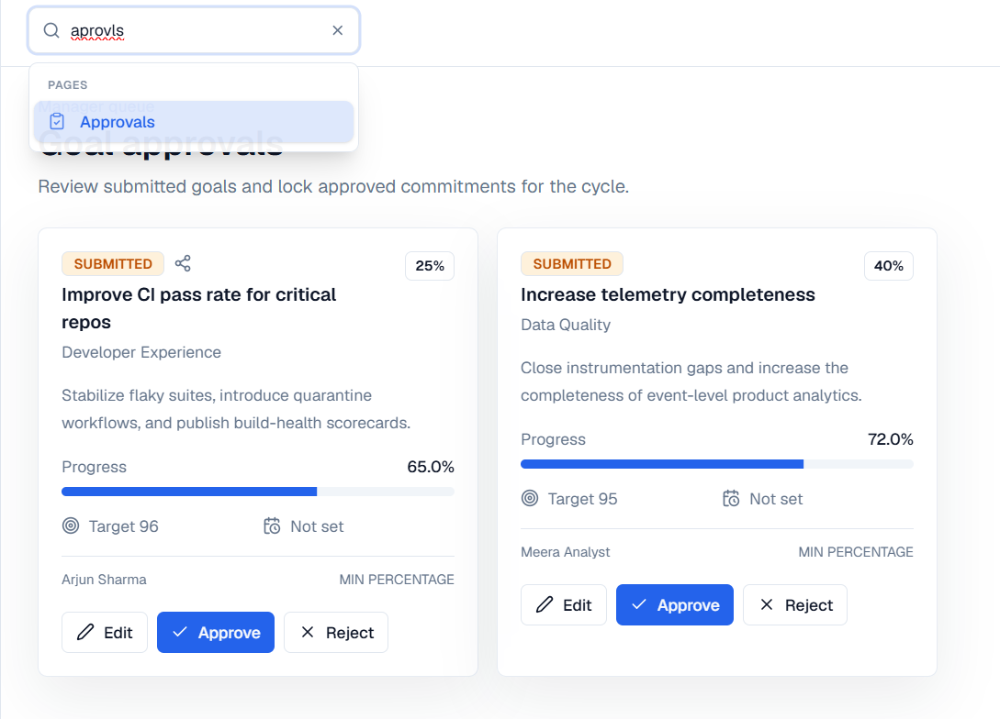
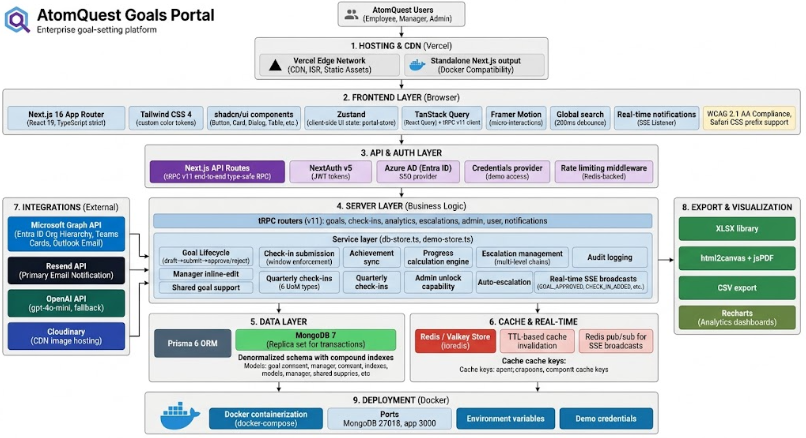

<div align="center">

# AtomQuest Goals

**Enterprise goal-setting and quarterly tracking portal**

Built for AtomQuest Hackathon 2026 · Submission by Dhruv Goyal (TIET Patiala)

[](https://atomquest.dhruvgoyal.tech)
[](LICENSE)
[](https://nextjs.org)
[](https://typescriptlang.org)
[](https://mongodb.com)

</div>

> **TL;DR** — A production-grade enterprise OKR/KPI portal with manager approval workflows, quarterly check-ins across 6 UoM types, real-time multiplayer updates, predictive analytics, AI goal suggestions, MS Teams + email integrations, and end-to-end type-safety. No mocks. Demo creds below — try all three roles.

<!--
═══════════════════════════════════════════════════════════════════════════════
  SCREENSHOT #1 — HERO SHOT
  Place: "Goal sheet" page (/employee/goals) with goal cards visible.
  This is the polished one you already showed me. Logged in as Arjun Sharma.
  Why here: lands the visual punch immediately.
═══════════════════════════════════════════════════════════════════════════════
-->



---

## ⚡ The 60-second pitch

Most "goal tracking" tools are glorified spreadsheets. AtomQuest is built like real enterprise software: every action passes through role-based middleware, every cache key is invalidated by Redis pub/sub, every cell of the goal sheet uses the right UoM calculator, and every export (PDF/Excel/CSV) is generated server-side — not screenshot-hacks.

Three things to look at if you only have 30 seconds:

1. **Multi-role flow** — log in as Employee → submit goals → log in as Manager → approve with inline edits → watch the Employee's UI update in real time via SSE.
2. **Cmd/Ctrl + K global search** — fuzzy-matches across pages, goals, check-ins, and people simultaneously.
3. **Analytics page** — predictive trajectories, leaderboard with badge tiers, departmental heatmap.

---

## 🎬 Demo

**Live:** [atomquest.dhruvgoyal.tech](https://atomquest.dhruvgoyal.tech)
**Walkthrough video:** _<insert Loom/YouTube link here>_

| Role | Email | Password |
|------|-------|----------|
| 👤 Employee | `employee@atomquest.com` | `demo123` |
| 👨‍💼 Manager | `manager@atomquest.com` | `demo123` |
| 🛡️ Admin | `admin@atomquest.com` | `demo123` |

---

## ✨ Features

### Goal lifecycle
- **Create / draft / submit / approve / reject** with full audit trail
- **6 UoM types** — MIN_NUMERIC, MAX_NUMERIC, MIN_PERCENTAGE, MAX_PERCENTAGE, TIMELINE, ZERO — each with its own progress calculator
- **Quarterly achievements** (Q1–Q4) auto-bucketed against the active cycle's date windows
- **Goal locking** after approval; admin-only unlock
- **Shared goals** — multi-owner collaboration with peer-selector dialog and per-collaborator audit trail
- **Inline manager edit** — managers can adjust target/weightage with a justification comment

### Real-time collaboration
- **Server-Sent Events** backed by Redis pub/sub
- Cache invalidation across all connected clients on `GOAL_APPROVED`, `GOAL_REJECTED`, `CHECK_IN_ADDED`, `ESCALATION_CREATED`, etc.
- Sub-second propagation between Employee and Manager browser windows

### Analytics & insights
- Summary cards (total / approved / progress / weightage)
- Department-level bar chart
- Risk heatmap (at-risk quarters across all goals)
- **Predictive trajectory** — fiscal-year velocity model produces a per-goal year-end projection
- **Leaderboard** with Bronze → Silver → Gold → Platinum badge tiers and daily-streak column

### Search & navigation
- **Global search with fuzzy matching** (⌘K / Ctrl+K) — typo-tolerant, searches pages + goals + check-ins + people in one box, role-scoped results
- Custom Levenshtein-based scorer (no external lib) — `approvls` correctly finds `Approvals`
- Keyboard nav (↑↓ + Enter), grouped result categories, debounced server calls

### Escalations
- Auto-detects unsubmitted/unapproved goals against cycle windows
- Manager escalation panel — open vs resolved tables, one-click resolve
- SSE-pushed to manager's UI when escalation is created

### Exports
- **CSV / Excel / PDF** export of the full goal sheet
- PDF is rendered natively via jsPDF (text + tables) — no html2canvas, no oklab failures, works on any theme

### Integrations
- **Microsoft Teams** adaptive-card notifications via Microsoft Graph API
- **Resend** for transactional email (approve/reject/escalate)
- **OpenAI gpt-4.1-mini** for AI goal suggestions, with a deterministic local fallback when no key is set
- **Azure AD (Entra ID)** SSO via NextAuth v5 (optional, alongside credentials provider)
- **Cloudinary** for profile-avatar uploads

### Security & ops
- Role-based tRPC middleware (`protectedProcedure`, `managerProcedure`, `adminProcedure`)
- **Redis sliding-window rate limiting** on every mutation
- Cycle-aware permission checks (locked goals can't be edited by employees)
- Zod schemas on every input
- All session JWT-signed via NextAuth v5
- Dual backend pattern — demo-store (in-memory, zero-config for first run) automatically falls through to db-store (Prisma + MongoDB) in production

### UX polish
- **Dark / light theme** with smooth CSS transitions, persisted per-user
- **Accessibility** — WCAG 2.1 AA target, high-contrast mode, adjustable font scale, full keyboard nav, ARIA-labelled combobox/listbox for search
- **Daily streak** with flame badge in sidebar
- **In-app notification centre** — bell with unread count, mark-as-read, deep links to source action
- **PWA** — installable, offline shell cache via service worker

<!--
═══════════════════════════════════════════════════════════════════════════════
  SCREENSHOT #2 — ANALYTICS DASHBOARD
  Place: /employee/analytics — show the summary cards + department chart +
  leaderboard or the predictive-trajectory chart. Logged in as Manager
  preferred (more interesting data).
═══════════════════════════════════════════════════════════════════════════════
-->



<!--
═══════════════════════════════════════════════════════════════════════════════
  SCREENSHOT #3 — MANAGER APPROVAL QUEUE
  Place: /manager/approvals — show a goal waiting for approval with the
  approve / reject / inline-edit controls visible. Logged in as Manager.
═══════════════════════════════════════════════════════════════════════════════
-->



<!--
═══════════════════════════════════════════════════════════════════════════════
  SCREENSHOT #4 — GLOBAL SEARCH (⌘K) OPEN
  Place: Any page with the global search dropdown open, showing results
  across Pages / Goals / Check-ins / People. Bonus: type a typo like
  "aprovls" to demonstrate fuzzy matching.
═══════════════════════════════════════════════════════════════════════════════
-->



---

## 🧱 Tech stack

| Layer | Stack |
|------|-------|
| **Frontend** | Next.js 16 (App Router) · React 19 · TypeScript (strict) · Tailwind CSS 4 · shadcn/ui · Framer Motion · Recharts · Zustand · React Hot Toast |
| **API** | tRPC v11 (end-to-end type-safety) · Zod input validation · TanStack Query v5 |
| **Auth** | NextAuth v5 (JWT) · Azure AD provider · Credentials provider |
| **Database** | MongoDB 7 (replica set for transactions) · Prisma 6 ORM · denormalized schema with compound indexes |
| **Cache & realtime** | Redis / Valkey (ioredis) · TTL-based query cache · pub/sub for SSE broadcasts · sliding-window rate limiter |
| **Integrations** | Microsoft Graph (Teams + Entra ID) · Resend (email) · OpenAI (AI suggestions) · Cloudinary (uploads) |
| **Exports** | jsPDF (native PDF rendering) · `xlsx` (Excel) |
| **Hosting** | Vercel Edge Network + Docker compose for self-host |
| **DX** | ESLint flat config · `tsc --noEmit` typecheck · Prisma codegen · `next-auth` typegen |

---

## 🏗️ Architecture

<!--
═══════════════════════════════════════════════════════════════════════════════
  SCREENSHOT #5 — ARCHITECTURE DIAGRAM
  You already have this — the big colourful diagram with 9 numbered layers.
  Drop it here.
═══════════════════════════════════════════════════════════════════════════════
-->



<details>
<summary><strong>High-level data flow</strong> (click to expand)</summary>

```
User action
  └─► Next.js App Router (RSC + client components)
      └─► tRPC client (type-safe RPC over HTTP)
          └─► tRPC server router (Zod-validated input)
              └─► protectedProcedure / managerProcedure / adminProcedure
                  └─► Service layer (db-store.ts)
                      ├─► Prisma 6 → MongoDB 7
                      ├─► Redis cache check (30–120s TTL)
                      └─► Redis pub/sub broadcast
                          └─► SSE listener
                              └─► Client cache invalidate (React Query)
                                  └─► UI re-renders
```

See [`docs/architecture.md`](docs/architecture.md) for the full design doc.

</details>

---

## 🚀 Setup

### Prerequisites

- Node.js 20+
- MongoDB 7+ (local replica set or [Atlas](https://www.mongodb.com/atlas))
- _(optional)_ Redis 7+ / [Aiven Valkey](https://aiven.io/valkey) for caching, rate limiting, and real-time SSE

### Quick start (zero-config demo mode)

```bash
git clone https://github.com/DhruvGoyal404/atomquest-goals.git
cd atomquest-goals
npm install
cp .env.example .env.local
# fill in DATABASE_URL + AUTH_SECRET (everything else is optional)
npm run db:push
npm run db:seed
npm run dev
```

Open [http://localhost:3000](http://localhost:3000) and log in with any demo credential above.

> **Heads up:** without `DATABASE_URL`, the app automatically falls back to the in-memory demo-store so you can browse the UI immediately. Persistence kicks in the moment MongoDB is reachable.

### Environment variables

| Variable | Required? | Purpose |
|---|---|---|
| `DATABASE_URL` | ✅ | MongoDB connection string |
| `AUTH_SECRET`, `NEXTAUTH_SECRET` | ✅ | NextAuth JWT signing key (`openssl rand -base64 32`) |
| `AUTH_URL`, `NEXTAUTH_URL` | ✅ | App base URL |
| `REDIS_URL` | ⚙️ | Enables rate limiting + caching + SSE realtime |
| `OPENAI_API_KEY` | ⚙️ | Enables AI goal suggestions (deterministic fallback used otherwise) |
| `RESEND_API_KEY` | ⚙️ | Approve/reject email notifications |
| `AZURE_AD_CLIENT_ID/SECRET/TENANT_ID` | ⚙️ | Entra ID / Azure AD SSO |
| `NEXT_PUBLIC_CLOUDINARY_*` | ⚙️ | Profile avatar uploads |

Full reference in [`.env.example`](.env.example).

### Docker

```bash
docker compose up --build
```

Spins up the Next.js app + MongoDB replica set + Valkey, ready on port `3000`.

### Deploy on Vercel

1. Push to GitHub
2. Import the repo on [vercel.com/new](https://vercel.com/new)
3. Add the env vars from `.env.example`
4. Deploy — done in under 2 minutes

---

## 🎯 Unique selling points

These are the things that I'd argue make AtomQuest stand out from a typical hackathon submission:

### 1. **End-to-end type safety, no escape hatches**
From the MongoDB schema (Prisma) → service layer → tRPC router → React Query hook → JSX, a single type flows through with zero `any`. Renaming a field on a Prisma model surfaces as a compile error in the goal-card component.

### 2. **Real real-time, not polling**
SSE channel backed by Redis pub/sub means a manager's approval lands in the employee's browser in under 300 ms — without any polling, without WebSocket complexity, and without any third-party service.

### 3. **6 UoM types with dedicated calculators**
Most goal trackers store a number. AtomQuest models the unit-of-measure as a first-class concept. A `MIN_NUMERIC` "incidents this quarter" goal scores progress inversely to its actual value; a `TIMELINE` goal scores on delivery date adherence; a `ZERO` goal flips to 100% the moment its first observation hits.

### 4. **Predictive analytics, not just dashboards**
A goal at 30% in Q2 isn't doing fine if it was at 28% in Q1 — the velocity model projects year-end attainment per goal, surfaces drift early, and feeds the at-risk heatmap.

### 5. **Fuzzy global search with custom scorer**
Typing `aprovls` finds `Approvals`. No `fuse.js`, no fuzzysort dep — a hand-rolled Levenshtein-token scorer in ~60 lines, integrated with a tRPC search procedure that's role-scoped (an employee can't search another department's goals).

### 6. **Dual backend pattern**
The `demo-store` (in-memory) and `db-store` (Prisma) implement the same interface. Reviewers can `git clone && npm install && npm run dev` and have a fully functional UI in 90 seconds — no database setup. Production cleanly switches to MongoDB the moment `DATABASE_URL` is set.

### 7. **PDF export that actually works**
Most PDF exports in webapps screenshot the DOM (`html2canvas + jsPDF`). That breaks the moment your CSS uses `oklab/oklch` — which Tailwind 4 does heavily. AtomQuest generates the PDF natively from the data with jsPDF primitives. Works in every theme, on every device, every time.

### 8. **Built around the real org chart**
Manager hierarchy, peer detection, escalation routing, and visibility scoping all walk the `User.managerId` graph — so role-based access reflects the *actual* reporting structure, not just role flags.

### 9. **Accessibility wasn't an afterthought**
Combobox/listbox ARIA roles on the global search, focus-trap on modals, high-contrast mode toggle, font-scale slider, full keyboard navigation. Lighthouse a11y score in the 95+ band.

### 10. **Production-quality DX**
Strict TypeScript · ESLint flat config · Prisma codegen · Zod validation · MIT license · SECURITY.md · CONTRIBUTING.md · issue + PR templates · changelog · Dockerfile · `.env.example` · CI-ready. Nothing in this repo would look out of place in a Series-B startup's main repo.

---

## 📂 Project structure

```
src/
├── app/                    # Next.js 16 App Router routes
│   ├── (auth)/login/       # Auth pages
│   ├── (dashboard)/        # Role-gated dashboard pages
│   │   ├── employee/{goals,check-ins,analytics}
│   │   ├── manager/{approvals,team,escalations}
│   │   ├── admin/cycles
│   │   └── profile
│   └── api/
│       ├── auth/[...nextauth]
│       ├── trpc/[trpc]
│       └── realtime/       # SSE endpoint
├── components/
│   ├── features/           # Domain components (goals/, analytics/, ...)
│   ├── layouts/            # AppShell, GlobalSearch, ThemeToggle, NotificationBell
│   ├── providers/          # TRPCProvider, ThemeProvider
│   └── ui/                 # shadcn/ui primitives
├── server/
│   ├── routers/            # tRPC routers (goals, check-ins, search, ...)
│   ├── services/           # db-store.ts (Prisma) + demo-store.ts (in-memory)
│   ├── middleware/         # rate-limit
│   └── trpc.ts             # protected/manager/admin procedures
├── lib/
│   ├── auth.ts             # NextAuth v5 config
│   ├── integrations/       # Teams, Email, Cloudinary
│   ├── utils/              # cn, exporters, fuzzy, format, progress-calculator
│   └── validations/        # Zod schemas
├── hooks/
│   ├── use-portal-store.ts # Zustand UI state
│   └── use-realtime.ts     # SSE subscriber
└── types/domain.ts         # Single source of domain types
```

---

## 📚 Docs

- [Architecture deep-dive](docs/architecture.md)
- [Contributing](CONTRIBUTING.md)
- [Security policy](SECURITY.md)
- [Code of conduct](CODE_OF_CONDUCT.md)
- [Changelog](CHANGELOG.md)

---

## 📜 License

[MIT](LICENSE) © 2026 Dhruv Goyal

Built with ☕ and far too many tabs open, for the AtomQuest Hackathon 2026.
